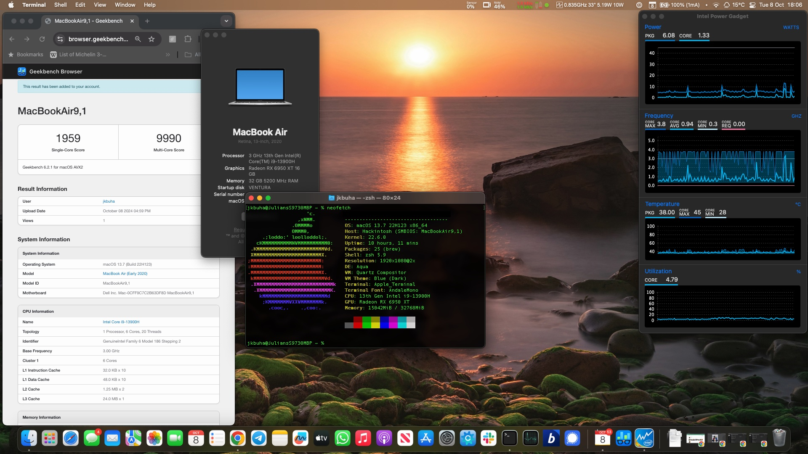

# Dell XPS 9730 macOS Ventura with OpenCore



# Details

| OpenCore Version | 1.0.3 |
| --- | --- |
| macOS Version | 13.7 (Ventura) |
| SMBios | MacBookAir9,1 |

# Hardware Specifications

| Hardware | Specification | Status |
| --- | --- | --- |
| CPU | Intel Core i9-13900H | ✅ Working |
| RAM | DDR5 32GB | ✅ Working |
| Audio | Realtek ALC711 | ❌ Not Working |
| WiFi | Killer 1675 (AX211) | ✅ Working |
| Bluetooth | AX211 Wi-Fi 5 | ✅ Working |
| SSD | Samsung SN850 4TB | ✅ Working |
| Keyboard | - | ✅ Working |
| Trackpad | I2C Connection | ✅ Working |
| Webcam | Microdia RGB IR HD camera | ✅ Working |
| MicroSD Card | RTS5260 Card Reader | ❌ Not Working |
| Fingerprint Sensor | Shenzen Goodix | ❌ Not Working |
| S4 | Hibernation | 🔶 In progress |
| GPU | Intel Iris Xe Graphics | ❌ Not Working |
| eGPU | AMD Radeon RX6950XT | ✅ Working |
| Display | 1920 x 1200 FHD LCD | ✅ Working |

# Overview

Setting up the XPS 9730 (with the 14-core i9 processor) was relatively 
easy based on my previous XPS 9520. The only major difference is that the 
ALC711 soundcard does not yet function under AppleALC, at least until 
someone figures out how to dump the codec properly under linux, which in 
reality is a non-issue as the HDMI-out audio works. Otherwise everything 
runs flawlessly, using an eGPU as the output device.

# BIOS Settings

| Setting | Option |
| --- | --- |
| SATA Operation | AHCI |
| Fast Boot | Thorough |
| Secure Boot | Disabled |
| TMP 2.0 Security | Disabled |
| Intel SGX | Disabled |
| VT for Direct I/O | Disabled |
| Fingerprint Reader | Disabled |

# UEFI IFR edits
Ahead of installing, as with other hackintoshes you will need to disable 
CFG_LOCK using modGRUBshell as follows:

```bash
setup_var_cv CpuSetup 0x43 0x00
```

# S3/S4 ACPI
Despite Dell's attempts to sabotage S3 sleep, there's an ongoing effort to render hiberation (S4) and then
sleep (S3) working again on this machine, having successfully enabled it on the XPS 9500. Currently WIP...
The first step is to re-enable S3 from the UEFI interface using modGRUBshell:

```bash
setup_var_cv Setup 0xE 0x01
```

S3 will be present in the macOS boot-up sequence, and will go to sleep but will crash upon startup. ACPI table edits to restore post-S3 sleep states 
are required, and this is currently WIP.


# Known Issues

- S3 Sleep not working properly yet
- S4 Sleep currently being worked on
- LVDS display remains off when eGPU connected

To allow the laptop to function in clamshell mode, you need to press Fn+F8 
on the clover boot menu to switch to the external display. That way the 
laptop LVDS screen is switched off and the external monitor is on. You 
need to connect a USB/Bluetooth mouse and keyboard, but the setup is much 
more practical in this way.

